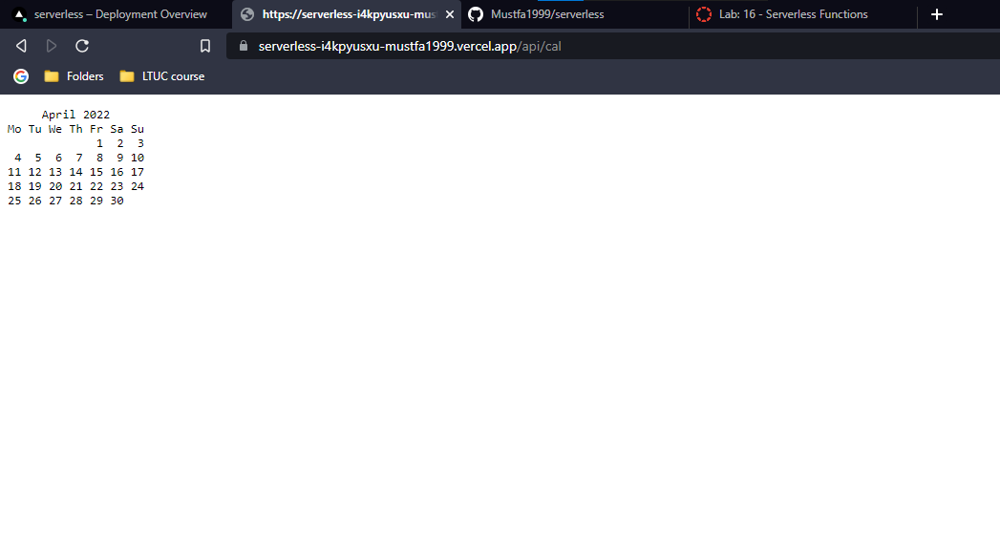

# Serverless Function

---
## Cal

This function prints the calendar of the month April/2022

### Test the function by:

- Go to the deployed site for the repo: [deployed](https://serverless-i4kpyusxu-mustfa1999.vercel.app)

- Add the following endpoint to the url (/api/cal), so it will be:

    https://serverless-i4kpyusxu-mustfa1999.vercel.app/api/cal

- You are going to see the calendar of the month April from the year 2022, like this:

